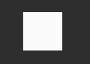
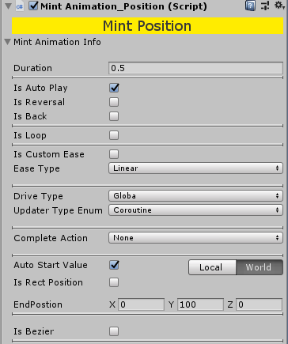
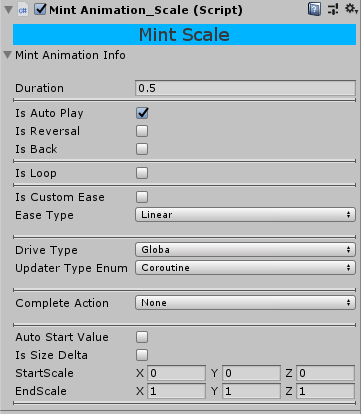
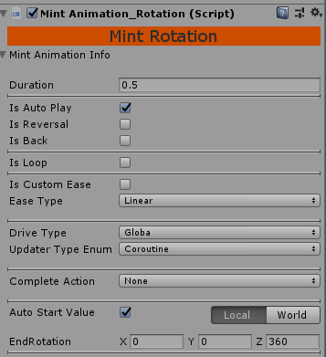
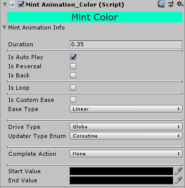
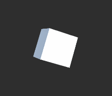

# MintAnimation

   

## 介绍
MintAnimation是一款轻量级动画插件，可用于UI的缓动动画以及其他游戏对象的补间动画。

此外MintAnimation不依赖任何第三方插值动画库，自己本身具备一套插值运算驱动，所有的动画组件都是基于此开发，并且做到了0 GC Alloc，效率也极为出众。

该插值库(MintAnimation.Core)支持扩展，用法与DoTween类似,使用者可以轻松的编写更加复杂的自定义动画。

## 项目结构
MintAnimation的核心是一套插值补间驱动(MintAnimation.Core)，且原生支持各种缓动函数，也可以使用Unity的自定义曲线。
并在此基础上拓展的动画组件。

#### MintAnimation
MintAnimation的基础组件分为5类，分别为：CanvasAlpha、Color、Position、Rotation、Scale。
* 使用：选中任意场景中的对象，点击Add Component => MintAnimation，然后选择需要的动画组件即可

#### 组件面板
所有基础动画组件都具备如下共同参数

属性|说明
|---|---
Duration|动画总时长
IsAutoPlay|是否自动播放(当对象被激活时)
IsReversal|是否反向播放(可用于UI关闭动画等)
IsBack|是否往返(每次播放会到达终点后又返回起点)
IsLoop|是否循环播放
LoopCount|循环次数(-1表示无限循环)
IsCustomEase|是否使用自定义缓动曲线(Unity自定义曲线)
EaseType|选择函数曲线的类型（建议使用函数曲线，而非自定义曲线，缓动函数更加标准，效率更高）
DriveType|动画驱动器选择
UpdaterTypeEnum|动画驱动类型
Component|动画播放结束后的默认行为
AutoStartValue|播放的起始值是否自动获取

#### 动画组件使用介绍

* CanvasAlpha


若不勾选AutoStartValue会出现StartAlpha滑动条，通过设置StartAlpha和EndAlpha控制对象的透明度，该组件仅支持UI对象。

以下是相同参数下改变EaseType的实际效果(gif录制帧率较低)

  

* Position



该组件控制对象的位移动画，支持UI、游戏对象，可以选择控制Local和World模式控制。

IsRectPosition选项用于对UI对象的更好支持，通过勾选则改变anchoredPosition3D属性，而非position属性，可以更好的兼容UI控件的自适应
如果你是用于控制UI对象，最好勾选该选项

此外该组件支持贝塞尔曲线(二阶贝塞尔)，勾选IsBezier后，出现P1 和 P2两个贝兹点,startPosition 和 endPosition作为P0和P3点
需要注意 p1和p2点的值是相对p0的相对位置。此外该版本暂未支持贝塞尔可视化编辑，将会在后续版本中添加。

基本效果演示:

  
 

* Scale



该组件控制物体的缩放大小

IsSizeDelta选项如果勾选则控制物体的SizeDelta大小，而非Scale属性

  

* Rotation



  

* Color



Color组件会控制对象上的所有材质的主贴图颜色

 

#### 不同组件之间的复合动画

 

 

## 进阶使用


## 如何添加到项目
Unity2018以上将以下字段添加到Packages/manifest.json中，(在dependencies标签中额外增加)
```
{
  "dependencies": {
    "com.foldcc.mintanimation": "https://gitee.com/Foldcc/MintAnimation.git#package_0.2.x"
  }
}
```
若你的Unity版本小于2018，请手动下载master分支的源码